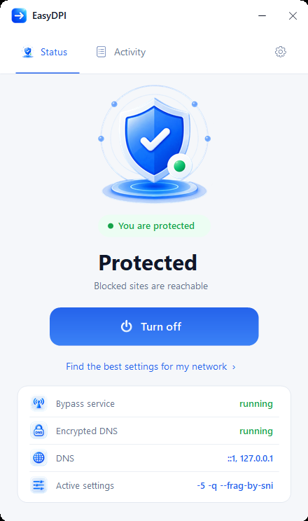
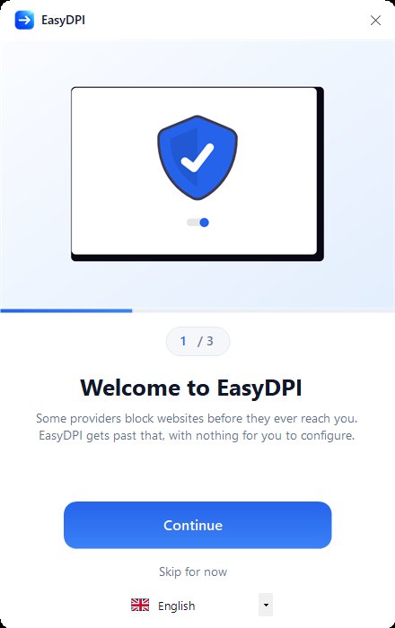

<div align="center">


# EasyDPI

**Get past ISP-level website blocking on Windows. One click, nothing to configure.**

[Türkçe](README.tr.md) · English

### [Download EasyDPI](../../releases/latest)



</div>

---

## What it does

In many countries your internet provider blocks websites in **two separate places**, and tools that only fix one of them leave you with pages that still refuse to load:

| Layer | What the provider does | What EasyDPI does |
|---|---|---|
| **DNS** | Domain lookups are answered with a fake address that points at a block page. Switching DNS servers usually does not help either, because queries to port 53 are dropped for blocked names. | Runs an encrypted DNS resolver locally. The provider cannot read the queries, so it cannot filter them. |
| **Inspection** | Your connections are examined and cut off mid-handshake when a blocked destination is recognised. | Reshapes the outgoing packets so the inspection never sees a complete name to match on. |

Both layers apply system-wide, so browsers **and** desktop applications are covered. There is nothing to configure per app.

## Getting started

1. Download the latest release and extract it anywhere
2. Run `EasyDPI.exe` — it asks for administrator rights, which it needs to install its services
3. Follow the three-step introduction and let it find the settings for your network

<div align="center">

</div>

EasyDPI installs two background services and keeps working after you close the window or restart the machine. Turning it off stops both services, restores your original DNS settings, and prevents them from starting again — the machine is left exactly as it was.

## Automatic configuration

This is the part that matters, and the reason this project exists.

The packet manipulation that defeats one provider's inspection does nothing against another's. Settings that work in one country routinely fail in the next. Most guides hand you a fixed command line and hope for the best.

EasyDPI measures your actual connection instead:

```
1) DNS check
   setup.roblox.com                clean
   discord.com                     clean
   x.com                           clean
   -> DNS is clean; leaving it alone.

2) Blocking scan (79 addresses, 9 services)
   Roblox client   11/13     closed: setup.roblox.com, clientsettingscdn.roblox.com
   Roblox site     20/20     all open
   Roblox CDN      7/7       all open
   Discord         5/5       all open
   Social          8/9       closed: web.telegram.org
   Control         8/8       all open

3) Screening every setting (21 candidates)
   -9 --frag-by-sni                                      1/3
   -5 -q --frag-by-sni                                   1/3
   -f 2 -e 2 --set-ttl 3 --reverse-frag --max-payload    3/3
   -f 2 -e 2 --native-frag --frag-by-sni -q              3/3
   -4                                                    0/3  (2 normal sites broken)

4) Measuring the best 3 for speed
   setting                                             opened  response  download
   -f 2 -e 2 --set-ttl 3 --reverse-frag --max-payload   3/3     181 ms    28.4 Mbps
   -f 2 -e 2 --native-frag --frag-by-sni -q             3/3     174 ms    19.2 Mbps

Best settings: -f 2 -e 2 --set-ttl 3 --reverse-frag --max-payload
Response 181 ms, download 28.4 Mbps
```

How it decides:

- **DNS tampering** is detected by resolving names twice — once through the system resolver, once over encrypted DNS — and comparing the answers. The sample is taken across services, not from the top of one list, because a provider may redirect one service and leave the rest alone.
- **Blocking** is measured per endpoint, over a real HTTPS request rather than a bare TLS handshake. Providers block names, so "roblox.com opens" says nothing about `setup.roblox.com` or `clientsettingscdn.roblox.com` — and those two are what leave the installer warning about missing flag settings while the website looks fine. An HTTP error such as 403 counts as reachable: the answer came from the server. Only a transport failure counts as blocked.
- **Every candidate is screened**, not just the ones before the first success. Several settings usually clear the same blocks and they are not equally good.
- **Speed decides between equals.** The leaders are re-measured with repeated requests and a download, and ranked on response time and throughput — but only after correctness: a fast setting that leaves a service unreachable has not solved anything, and breaking a site that worked is weighted more heavily than opening one more that did not.
- **What is still blocked is printed.** If the best setting cannot open something, the report names it instead of ending on "best settings found".

The probe list is built from the endpoints applications actually call — Roblox's own network allowlist plus the hosts its client and website use at runtime, Discord's, and sites from the Citizen Lab test lists — and every address in it was verified to resolve and answer before being included.

The result is written to `bin/config.ini`. Run it again whenever you change networks.

**On a network the defaults do not cover:** the built-in probe list covers commonly blocked services across several regions, but it cannot cover everything. If EasyDPI reports no blocking while a site you need is still unreachable, add that site to `probeDomains` in `bin/config.ini` and run the tuner again.

## The log tab

Everything the application does is written to the log as it happens, and kept in `easydpi.log` between runs so it is still there the next time you open the window.

Two buttons sit under it.

**Save report** writes one file holding the log, your settings, the state of both services and the packet driver, the DNS servers your adapter is set to, and which of the shipped files are present. It exists so that reporting a problem is one click instead of an interview — attach it to an issue. The file states in its own header what it contains, and it contains nothing about the sites you visit.

**Remove EasyDPI** uninstalls everything in one step: both services stopped and unregistered, the WinDivert driver unregistered, DNS handed back to your network, and the application's own files deleted. Only files EasyDPI installed are removed — anything else you keep in that folder is left alone, and the folder itself goes only if nothing remains in it.

## Using it with a VPN

They can both be on, and EasyDPI now stays out of the VPN's way, but they overlap and the overlap costs something.

DNS is the part that is fully solved. EasyDPI never writes its resolver setting to a VPN adapter, and when protection is turned off it restores only the adapters it pointed at the local resolver — so a VPN's own DNS configuration is left alone instead of being reset along with everything else.

Packets are the part that is a trade-off. The most effective settings work by sending fake packets that are supposed to reach the equipment inspecting your connection and die before the real server sees them. That aim is calculated for the route out of your machine, and inside a tunnel your traffic does not take that route — the packet meant to die on the way can arrive at the server and break the connection instead. So when a VPN is connected, the tuner leaves those settings out and picks the best of the ones that only fragment. Expect it to get past less: fragmentation alone is weaker than fragmentation plus fake packets on most networks.

If a VPN is already carrying your traffic past the inspection, you do not need EasyDPI for the sites it carries. Its value with a VPN connected is the encrypted DNS and whatever the tunnel is not routing.

## Updates

When the window opens, EasyDPI asks GitHub whether a newer release exists. If there is one it says so, once per release, and offers to install it: the archive is downloaded, checked against the SHA-256 published for it, and only then unpacked over your installation. Your `bin/config.ini` is not in the archive, so your settings survive. Protection is restored afterwards if it was on, and the application restarts into the new version.

An archive that fails its checksum is deleted without being opened, and nothing in your installation is touched until the moment the verified copy is put in place. If a release cannot be verified automatically, EasyDPI offers to open its download page instead of installing anything.

Set `updateCheck=0` in `bin/config.ini` to turn the check off entirely.

## Languages

English, Turkish and Russian, selected automatically from your Windows language and changeable during setup or via `language=` in `bin/config.ini`.

Adding one is deliberately easy: copy the English block in [`src/Strings.cs`](src/Strings.cs), translate the values, register it in `BuildCatalog()`. Missing keys fall back to English, so a partial translation is still usable. Pull requests welcome.

## Command line

For scripting or scheduled tasks, run as administrator:

```
EasyDPI.exe /auto    measure the network, find working settings, apply them
EasyDPI.exe /on      turn protection on using the saved settings
EasyDPI.exe /off     turn protection off and restore DNS
```

Output goes to `easydpi.log`.

## Windows warns you on first run

EasyDPI is not code signed, so Microsoft Defender SmartScreen shows **"Windows protected your PC — Unknown publisher"** the first time you run it. Click **More info**, then **Run anyway**. It only asks once.

This is not specific to EasyDPI. SmartScreen shows the same warning for every unsigned executable that has not yet built up download reputation, and a signing certificate costs a few hundred dollars a year — hard to justify for a free tool.

Antivirus software occasionally goes further and blocks the file outright, with a message about a virus or potentially unwanted software. That verdict comes from reputation and behaviour scoring rather than from a signature: EasyDPI is unsigned, newly published, installs services and loads a packet driver, which together describe a lot of malware and also describe this. If it happens to you, please [report it as a false positive to Microsoft](https://www.microsoft.com/en-us/wdsi/filesubmission) — that is what gets it fixed for everybody rather than only on your machine — and, if you want it working in the meantime, restore it from **Windows Security → Protection history**. Verify the checksum below first; the point of publishing it is that you do not have to take anyone's word for what you are running.

If you would rather verify the download than trust it, check the archive before extracting:

```powershell
Get-FileHash EasyDPI-1.2.3.zip -Algorithm SHA256
```

and compare it with the SHA256 published in the notes of the [release you downloaded](https://github.com/ozkanbatmaz/EasyDPI/releases/latest). If it matches, the file is byte for byte what was uploaded here.

The checksum lives in the release notes rather than in this file, because this file is inside the archive it would be describing.

## Limitations

- **It does not hide your IP address or your location.** It changes the shape of your packets, not where they come from. Every site you visit still sees your real address. That requires a VPN, which unavoidably adds latency.
- **Windows only.** It depends on a Windows packet driver.
- **Some providers cannot be bypassed this way.** If no candidate works, EasyDPI says so plainly rather than pretending otherwise.
- **Every network call and system change is documented** in the [transparency report](TRANSPARENCY.md), including checksums for every shipped binary.
- **Measured performance cost is negligible** — around 0.2% on download throughput, within measurement noise. Name resolution usually gets slightly *faster*, because the local resolver caches.

## Layout

```
EasyDPI.exe          the application
bin/                 bypass engine, packet driver, config.ini
dns/                 encrypted DNS resolver and its configuration
licenses/            third-party licenses
src/                 source and build script
docs/                images used by this README
```

## Building from source

No Visual Studio, no SDK, no package manager. The C# compiler that ships with .NET Framework 4.x — present on every Windows 10 and 11 machine — is enough:

```
src\build.cmd
```

`EasyDPI.exe` appears in the parent folder.

## Credits

EasyDPI is a user interface and an automation layer. The tools doing the actual work belong to other people:

| Project | Author | License |
|---|---|---|
| [GoodbyeDPI](https://github.com/ValdikSS/GoodbyeDPI) | ValdikSS | Apache 2.0 |
| [WinDivert](https://github.com/basil00/WinDivert) | Basil Fierz | LGPLv3 / GPLv3 |
| [dnscrypt-proxy](https://github.com/DNSCrypt/dnscrypt-proxy) | Frank Denis | ISC |
| [unDraw](https://undraw.co) | Katerina Limpitsouni | unDraw licence (free, no attribution required) |

Full license texts are in [`licenses/`](licenses/). EasyDPI's own code is [MIT](LICENSE) licensed.

## Disclaimer

This tool was written to fix access problems on your own device and your own connection. How you use it, and compliance with the laws where you live, is your responsibility.
