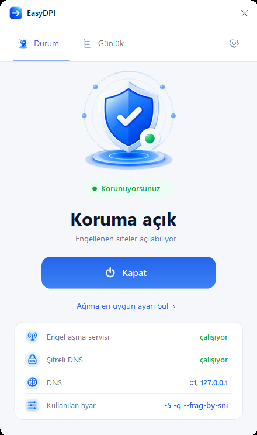
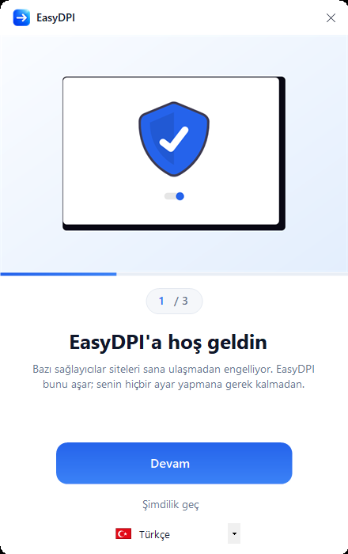

<div align="center">


# EasyDPI

**Windows'ta operatör seviyesindeki site engellerini aşar. Tek tık, ayar yok.**

Türkçe · [English](README.md)

### [EasyDPI'ı indir](../../releases/latest)



</div>

---

## Ne işe yarar

Birçok ülkede operatörler siteleri **iki ayrı katmanda** engeller. Sadece birini çözen araçlar yarım kalır, sayfalar yine açılmaz:

| Katman | Operatör ne yapıyor | EasyDPI ne yapıyor |
|---|---|---|
| **DNS** | Alan adı sorgularına engel sayfasına işaret eden sahte bir adres dönüyor. Farklı bir DNS sunucusu yazmak da genelde çözmez, çünkü engelli adlar için 53 numaralı porta giden sorgular düşürülüyor. | Yerelde şifreli bir DNS çözümleyicisi çalıştırır. Operatör sorguların içeriğini göremediği için filtreleyemez. |
| **İnceleme** | Bağlantıların içi okunuyor ve engelli bir hedef tanındığında el sıkışma ortasında kesiliyor. | Giden paketleri, incelemenin eşleştirebileceği bütün bir ad göremeyeceği şekilde yeniden biçimlendirir. |

İki katman da sistem genelinde çalışır; tarayıcı **ve** masaüstü uygulamaları kapsanır. Uygulama başına ayar gerekmez.

## Başlangıç

1. Son sürümü indir, istediğin bir klasöre çıkar
2. `EasyDPI.exe`'yi çalıştır — servislerini kurabilmek için yönetici izni ister
3. Üç adımlık tanıtımı geç ve ağına uygun ayarı bulmasına izin ver

<div align="center">

</div>

EasyDPI arka planda çalışan iki servis kurar; pencereyi kapatsan da bilgisayarı yeniden başlatsan da çalışmaya devam eder. Kapattığında iki servisi de durdurur, DNS ayarlarını eski haline döndürür ve tekrar başlamalarını engeller — makine bıraktığın gibi kalır.

## Otomatik ayar

Bu projenin asıl varlık sebebi bu kısım.

Bir operatörün incelemesini atlatan paket müdahalesi, diğerinde hiçbir işe yaramaz. Bir ülkede çalışan ayar diğerinde düzenli olarak başarısız olur. Çoğu rehber sana sabit bir komut satırı verip en iyisini umar.

EasyDPI bunun yerine senin bağlantını ölçer:

```
1) DNS kontrolü
   setup.roblox.com                temiz
   discord.com                     temiz
   x.com                           temiz
   -> DNS temiz; dokunulmayacak.

2) Engel taraması (79 adres, 9 servis)
   Roblox client   11/13     kapalı: setup.roblox.com, clientsettingscdn.roblox.com
   Roblox site     20/20     hepsi açık
   Roblox CDN      7/7       hepsi açık
   Discord         5/5       hepsi açık
   Social          8/9       kapalı: web.telegram.org
   Control         8/8       hepsi açık

3) Tüm ayarlar eleniyor (21 aday)
   -9 --frag-by-sni                                      1/3
   -5 -q --frag-by-sni                                   1/3
   -f 2 -e 2 --set-ttl 3 --reverse-frag --max-payload    3/3
   -f 2 -e 2 --native-frag --frag-by-sni -q              3/3
   -4                                                    0/3  (2 normal site bozuldu)

4) En iyi 3 aday hız için ölçülüyor
   ayar                                                açılan  yanıt     indirme
   -f 2 -e 2 --set-ttl 3 --reverse-frag --max-payload   3/3     181 ms    28.4 Mbps
   -f 2 -e 2 --native-frag --frag-by-sni -q             3/3     174 ms    19.2 Mbps

En iyi ayar: -f 2 -e 2 --set-ttl 3 --reverse-frag --max-payload
Yanıt 181 ms, indirme 28.4 Mbps
```

Nasıl karar veriyor:

- **DNS müdahalesi**, adlar iki kez çözülerek anlaşılır — biri sistem çözümleyicisiyle, biri şifreli DNS ile — ve cevaplar karşılaştırılır. Örneklem tek bir listenin başından değil, servislere yayılarak alınır; çünkü bir sağlayıcı yalnız bir servisi yönlendirip gerisine dokunmayabilir.
- **Engelleme**, uç nokta bazında ve ham TLS el sıkışması yerine gerçek bir HTTPS isteğiyle ölçülür. Engel alan adına konur: "roblox.com açılıyor" cümlesi `setup.roblox.com` ya da `clientsettingscdn.roblox.com` hakkında hiçbir şey söylemez — kurulumun "bayrak ayarları alınamadı" uyarısını verirken sitenin sapasağlam görünmesinin sebebi tam olarak bu ikisidir. 403 gibi bir HTTP hatası "ulaşıldı" sayılır, çünkü cevabı sunucu vermiştir; yalnız taşıma katmanı hataları engel sayılır.
- **Her aday denenir**, ilk başarıya kadar olanlar değil. Genelde birden çok ayar aynı engelleri açar ve hepsi eşit değildir.
- **Hız, eşitleri ayırır.** Öne çıkan adaylar tekrarlı isteklerle ve bir indirme ile yeniden ölçülür, yanıt süresi ve hıza göre sıralanır — ama önce doğruluk gelir: bir servisi kapalı bırakan hızlı ayar hiçbir şey çözmemiştir ve çalışan bir siteyi bozmak, kapalı bir siteyi daha açmaktan daha ağır cezalandırılır.
- **Hâlâ kapalı olan yazılır.** En iyi ayar bir şeyi açamıyorsa rapor onu adıyla söyler, "en iyi ayar bulundu" deyip kapatmaz.

Test listesi uygulamaların gerçekten çağırdığı uç noktalardan kuruldu — Roblox'un kendi ağ izin listesi, artı istemcinin ve sitenin çalışırken kullandığı adresler, Discord'unkiler ve Citizen Lab test listelerinden siteler — ve listedeki her adres, eklenmeden önce çözülüp cevap verdiği doğrulandı.

Sonuç `bin/config.ini` dosyasına yazılır. Ağ değiştirdiğinde tekrar çalıştırman yeterli.

**Varsayılanların kapsamadığı bir ağdaysan:** yerleşik test listesi birkaç bölgede yaygın olarak engellenen servisleri kapsar ama her şeyi kapsayamaz. EasyDPI "engelleme yok" derken ihtiyacın olan bir site hâlâ açılmıyorsa, o siteyi `bin/config.ini` içindeki `probeDomains` satırına ekleyip tekrar çalıştır.

## Günlük sekmesi

Uygulamanın yaptığı her şey olurken günlüğe yazılıyor ve çalıştırmalar arasında `easydpi.log` dosyasında saklanıyor; pencereyi bir dahaki açışında geçmiş yerinde duruyor.

Altında iki buton var.

**Rapor İndir**, tek bir dosyaya şunları yazar: günlük, ayarların, iki servisin ve paket sürücüsünün durumu, adaptörünün ayarlı olduğu DNS sunucuları ve paketle gelen dosyalardan hangilerinin yerinde olduğu. Bir sorunu bildirmek soru-cevap faslı yerine tek tık olsun diye var — dosyayı issue'ya ekle yeter. Dosya kendi başlığında ne içerdiğini yazıyor ve girdiğin sitelere dair hiçbir şey içermiyor.

**Uygulamayı Sil**, her şeyi tek adımda kaldırır: iki servis de durdurulup kaydı silinir, WinDivert sürücüsünün kaydı kaldırılır, DNS ağına geri verilir ve uygulamanın kendi dosyaları silinir. Yalnız EasyDPI'ın kurduğu dosyalar silinir — o klasörde tuttuğun başka her şey yerinde kalır, klasörün kendisi de ancak içi boşaldıysa kaldırılır.

## VPN ile birlikte kullanım

İkisi birlikte açık olabilir, EasyDPI artık VPN'in yoluna çıkmıyor; ama örtüşüyorlar ve bu örtüşmenin bir bedeli var.

DNS tarafı tamamen çözüldü. EasyDPI çözümleyici ayarını hiçbir zaman bir VPN adaptörüne yazmıyor, koruma kapatıldığında da yalnızca kendi yerel çözümleyiciye yönlendirdiği adaptörleri geri alıyor — yani VPN'in kendi DNS yapılandırması, diğer her şeyle birlikte sıfırlanmak yerine olduğu gibi kalıyor.

Paket tarafı ise bir takas. En etkili ayarlar, bağlantını inceleyen donanıma ulaşıp gerçek sunucuya varmadan ölmesi gereken sahte paketler göndererek çalışıyor. Bu nişan, senin makinenden çıkan yola göre hesaplanıyor; tünel içindeyken trafiğin o yoldan gitmiyor — yolda ölmesi gereken paket sunucuya kadar varıp bağlantıyı bozabiliyor. Bu yüzden VPN bağlıyken ayar bulucu o ayarları listeden çıkarıp yalnızca parçalama yapanların en iyisini seçiyor. Daha azını açmasını bekle: çoğu ağda tek başına parçalama, parçalama + sahte paketten zayıftır.

VPN zaten trafiğini incelemenin ötesine taşıyorsa, taşıdığı siteler için EasyDPI'a ihtiyacın yok. VPN bağlıyken değeri, şifreli DNS ve tünelin yönlendirmediği her şey.

## Güncellemeler

Pencere açıldığında EasyDPI, GitHub'a daha yeni bir sürüm olup olmadığını sorar. Varsa bunu sürüm başına bir kez söyler ve kurmayı önerir: arşiv indirilir, o dosya için yayınlanan SHA-256 ile karşılaştırılır ve ancak ondan sonra kurulumunun üzerine açılır. `bin/config.ini` arşivin içinde olmadığı için ayarların yerinde kalır. Koruma açıksa sonrasında geri açılır ve uygulama yeni sürümle yeniden başlar.

Sağlaması tutmayan arşiv hiç açılmadan silinir; doğrulanmış kopya yerine konana kadar kurulumundaki hiçbir şeye dokunulmaz. Bir sürüm otomatik olarak doğrulanamıyorsa EasyDPI hiçbir şey kurmaz, bunun yerine indirme sayfasını açmayı önerir.

Kontrolü tamamen kapatmak için `bin/config.ini` içine `updateCheck=0` yaz.

## Diller

İngilizce, Türkçe ve Rusça. Windows dilinden otomatik seçilir; kurulum sırasında veya `bin/config.ini` içindeki `language=` ile değiştirilebilir.

Yeni dil eklemek bilerek kolay tutuldu: [`src/Strings.cs`](src/Strings.cs) içindeki İngilizce bloğu kopyala, değerleri çevir, `BuildCatalog()` içine kaydet. Eksik anahtarlar İngilizceye düşer, yani yarım çeviri bile kullanılabilir. Katkılara açık.

## Komut satırı

Betik veya zamanlanmış görev için, yönetici olarak:

```
EasyDPI.exe /auto    ağı ölçer, çalışan ayarı bulur ve uygular
EasyDPI.exe /on      kayıtlı ayarla korumayı açar
EasyDPI.exe /off     korumayı kapatır, DNS'i geri alır
```

Çıktı `easydpi.log` dosyasına yazılır.

## İlk çalıştırmada Windows uyarısı

EasyDPI kod imzası taşımıyor, bu yüzden Microsoft Defender SmartScreen ilk açılışta **"Windows kişisel bilgisayarınızı korudu — Bilinmeyen yayıncı"** uyarısını gösteriyor. **Ek bilgi** deyip **Yine de çalıştır**'a bas; bir daha sormaz.

Bu EasyDPI'a özel değil. SmartScreen, henüz indirme itibarı oluşmamış her imzasız uygulamada aynı uyarıyı verir; imza sertifikası da yılda birkaç yüz dolar tutuyor ve ücretsiz bir araç için karşılığı yok.

Antivirüs bazen bir adım öteye gidip dosyayı tamamen engelleyebiliyor: "virüs veya istenmeyen yazılım içeriyor" mesajı. Bu karar bir imzadan değil, itibar ve davranış puanlamasından geliyor: EasyDPI imzasız, yeni yayınlanmış, servis kuruyor ve paket sürücüsü yüklüyor — bunların toplamı birçok zararlıyı tarif ettiği gibi bunu da tarif ediyor. Başına gelirse lütfen [Microsoft'a yanlış pozitif olarak bildir](https://www.microsoft.com/en-us/wdsi/filesubmission); sorunu yalnız senin makinende değil herkes için çözen şey bu. O arada çalıştırmak istersen **Windows Güvenliği → Koruma geçmişi** üzerinden geri yükleyebilirsin. Önce aşağıdaki sağlama toplamını doğrula; onu yayınlamamızın sebebi tam olarak bu — ne çalıştırdığın konusunda kimsenin sözüne güvenmek zorunda kalma.

Güvenmek yerine doğrulamak istersen, açmadan önce arşivin sağlama toplamına bak:

```powershell
Get-FileHash EasyDPI-1.2.3.zip -Algorithm SHA256
```

ve çıkan değeri [indirdiğin sürümün](https://github.com/ozkanbatmaz/EasyDPI/releases/latest) notlarında yayınlanan SHA256 ile karşılaştır. Tutuyorsa dosya, buraya yüklenenin bayt bayt aynısıdır.

Sağlama toplamı bu dosyada değil sürüm notlarında duruyor; çünkü bu dosya, tarif edeceği arşivin içinde.

## Sınırlar

- **IP adresini ve konumunu gizlemez.** Paketlerin biçimini değiştirir, nereden geldiklerini değil. Girdiğin her site gerçek adresini görmeye devam eder. Bunun için VPN gerekir, o da kaçınılmaz olarak gecikme ekler.
- **Sadece Windows.** Bir Windows paket sürücüsüne dayanır.
- **Bazı operatörler bu yöntemle aşılamaz.** Hiçbir aday çalışmazsa EasyDPI bunu açıkça söyler, çalışıyormuş gibi yapmaz.
- **Ağa çıkan her çağrı ve sistemde yapılan her değişiklik** [şeffaflık raporunda](TRANSPARENCY.tr.md) belgelendi; gönderilen her ikili dosyanın sağlama toplamı dahil.
- **Ölçülen performans etkisi ihmal edilebilir** — indirme hızında yaklaşık %0.2, yani ölçüm gürültüsü seviyesinde. Ad çözümleme genelde biraz *hızlanır*, çünkü yerel çözümleyici önbellek tutar.

## Klasör yapısı

```
EasyDPI.exe          uygulama
bin/                 engel aşma motoru, paket sürücüsü, config.ini
dns/                 şifreli DNS çözümleyicisi ve yapılandırması
licenses/            üçüncü taraf lisansları
src/                 kaynak kod ve derleme betiği
docs/                bu README'nin görselleri
```

## Kaynaktan derleme

Visual Studio yok, SDK yok, paket yöneticisi yok. .NET Framework 4.x ile gelen C# derleyicisi — her Windows 10 ve 11'de kurulu — yeterli:

```
src\build.cmd
```

`EasyDPI.exe` bir üst klasörde oluşur.

## Teşekkür

EasyDPI bir arayüz ve otomasyon katmanıdır. Asıl işi yapan araçlar başkalarına ait:

| Proje | Geliştirici | Lisans |
|---|---|---|
| [GoodbyeDPI](https://github.com/ValdikSS/GoodbyeDPI) | ValdikSS | Apache 2.0 |
| [WinDivert](https://github.com/basil00/WinDivert) | Basil Fierz | LGPLv3 / GPLv3 |
| [dnscrypt-proxy](https://github.com/DNSCrypt/dnscrypt-proxy) | Frank Denis | ISC |
| [unDraw](https://undraw.co) | Katerina Limpitsouni | unDraw lisansı (ücretsiz, atıf gerekmez) |

Lisans metinlerinin tamamı [`licenses/`](licenses/) klasöründedir. EasyDPI'ın kendi kodu [MIT](LICENSE) lisanslıdır.

## Sorumluluk reddi

Bu araç kendi cihazında, kendi bağlantında erişim sorunlarını gidermek için yazıldı. Nasıl kullanacağın ve bulunduğun yerin mevzuatına uyum senin sorumluluğunda.
